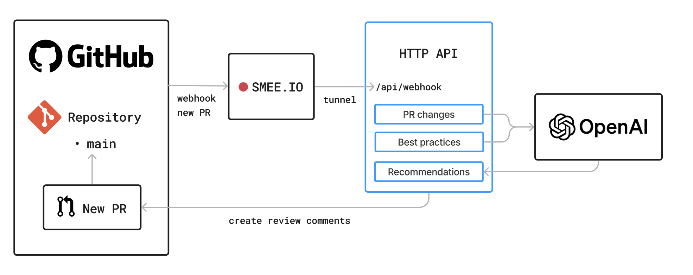

# GitHub App: PR Reviewer

Github app that processes new pull requests and adds feedback comments on these PRs based on a set of rules configured.

## Architecture

## Requirements

- [Register a GithubApp](https://docs.github.com/en/apps/creating-github-apps/registering-a-github-app/registering-a-github-app) in your account.
- Node.js 16
- A GitHub App subscribed to **Pull Request** events and with the following permissions:
  - Pull requests: Read & write
  - Metadata: Read-only
- (For local development) A tunnel to expose your local server to the internet: [smee](https://smee.io/).
- Your GitHub App Webhook must be configured to receive events at a URL that is accessible from the internet.

## Setup

1. Clone this repository.
2. Rename the `.env.example` to `.env` and set your actual values.
3. Install dependencies with `npm install`.
4. Start the server with `npm start`.
5. Ensure your GitHub App includes at least one repository on its installations.

## Usage

With your server running, you can now create a pull request on any repository that
your app can access. GitHub will emit a `pull_request.opened` event and will deliver
the corresponding Webhook [payload](https://docs.github.com/webhooks-and-events/webhooks/webhook-events-and-payloads#pull_request) to your server.

The server listens for `pull_request.opened` events and acts on
them by creating review comments on the pull request, using the [octokit.js rest methods](https://github.com/octokit/octokit.js#octokitrest-endpoint-methods).
